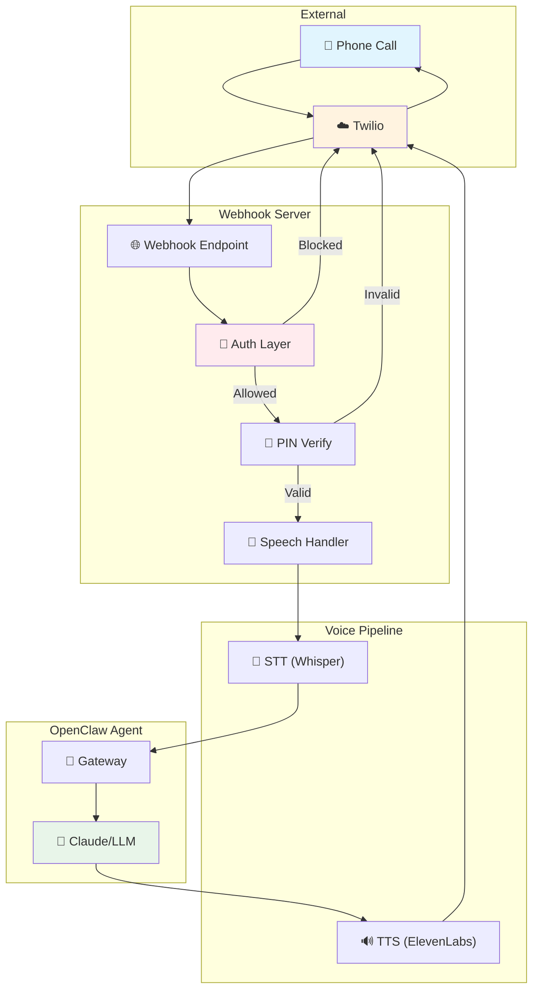
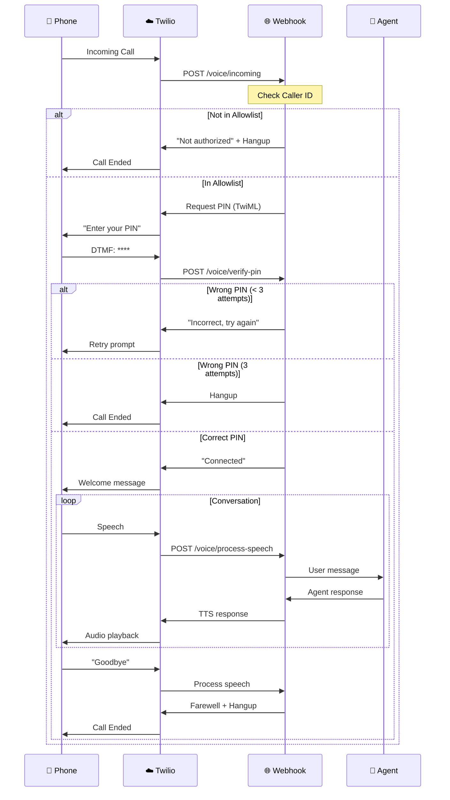
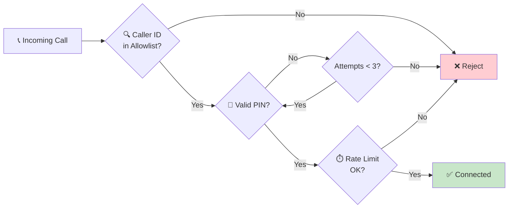

# OpenClaw Twilio Voice Skill

> 📞 Voice agent integration for OpenClaw/Clawdbot via Twilio

Enable AI agents to receive and handle phone calls with multi-layer security verification.

## ✨ Features

- 📞 **Receive Incoming Calls** - Twilio webhook integration
- 🔐 **Caller ID Verification** - Allowlist-based access control
- 🔢 **PIN Authentication** - 4-6 digit verification
- 🎤 **Speech-to-Text** - Convert caller speech to text (Whisper/Groq)
- 🔊 **Text-to-Speech** - Agent responses via voice (ElevenLabs/OpenAI)
- 📊 **Call Logging** - Full audit trail
- ⏱️ **Rate Limiting** - Prevent abuse

## 🏗️ Architecture



## 🔄 Call Flow Sequence



## 🔐 Security Layers



## 🚀 Quick Start

### 1. Clone & Install

```bash
git clone https://github.com/CodaLabs-xyz/openclaw-twilio-voice-skill
cd openclaw-twilio-voice-skill
npm install
```

### 2. Configure

```bash
cp voice-config.example.json voice-config.json
```

Edit `voice-config.json`:
```json
{
  "allowedNumbers": [
    { "number": "+1234567890", "pin": "1234", "name": "Julio" }
  ],
  "maxAttempts": 3,
  "rateLimitPerHour": 5
}
```

### 3. Set Environment Variables

```bash
export TWILIO_ACCOUNT_SID="ACxxxxxxxxxx"
export TWILIO_AUTH_TOKEN="your_auth_token"
export TWILIO_PHONE_NUMBER="+1234567890"
```

### 4. Run Server

```bash
# Development
npm run dev

# Production
npm start
```

### 5. Expose Webhook (Development)

```bash
ngrok http 3001
```

### 6. Configure Twilio

Set your Twilio phone number's webhook URL to:
```
https://your-domain.ngrok.io/voice/incoming
```

## 📁 Project Structure

```
openclaw-twilio-voice-skill/
├── SKILL.md                    # OpenClaw skill documentation
├── README.md                   # This file
├── LICENSE                     # MIT License
├── package.json
├── voice-config.example.json   # Example configuration
├── scripts/
│   └── webhook-server.js       # Main webhook server
└── references/
    ├── twilio-api.md           # Twilio API reference
    └── twiml-patterns.md       # TwiML examples
```

## 💰 Estimated Costs

| Item | Cost |
|------|------|
| Twilio Phone Number | ~$1.15/month |
| Inbound Minutes | ~$0.0085/min |
| Outbound Minutes | ~$0.014/min |
| TTS (ElevenLabs) | ~$0.30/1K chars |
| STT (Groq) | Free tier |

**Estimated total: $5-15/month** for moderate use.

## 🔧 API Endpoints

| Endpoint | Method | Description |
|----------|--------|-------------|
| `/voice/incoming` | POST | Twilio webhook for incoming calls |
| `/voice/verify-pin` | POST | PIN verification callback |
| `/voice/process-speech` | POST | Speech processing callback |
| `/health` | GET | Health check |

## 📖 Documentation

- [SKILL.md](SKILL.md) - Complete skill documentation for OpenClaw
- [references/twilio-api.md](references/twilio-api.md) - Twilio API reference
- [references/twiml-patterns.md](references/twiml-patterns.md) - TwiML examples

## 🤝 Contributing

Contributions welcome! Please read the contributing guidelines first.

## 📄 License

[MIT](LICENSE) © PerkOS

---

Built with ❤️ for the [OpenClaw](https://github.com/clawdbot/clawdbot) ecosystem.
