# OpenClaw Twilio Voice Skill

> 📞 Voice agent integration for OpenClaw/Clawdbot via Twilio

Enable AI agents to receive and handle phone calls with multi-layer security verification.

## ✨ Features

- 📞 **Receive Incoming Calls** - Twilio webhook integration
- 🔐 **Caller ID Verification** - Allowlist-based access control
- 🔢 **PIN Authentication** - 4-6 digit verification
- 🎤 **Speech-to-Text** - Convert caller speech to text (Whisper/Groq)
- 🔊 **Text-to-Speech** - Agent responses via voice (ElevenLabs/OpenAI)
- 📊 **Call Logging** - Full audit trail
- ⏱️ **Rate Limiting** - Prevent abuse

## 🏗️ Architecture

```mermaid
graph TB
    subgraph External["External"]
        Phone["📱 Phone Call"]
        Twilio["☁️ Twilio"]
    end
    
    subgraph Server["Webhook Server"]
        Webhook["🌐 Webhook Endpoint"]
        Auth["🔐 Auth Layer"]
        PIN["🔢 PIN Verify"]
        Speech["🎤 Speech Handler"]
    end
    
    subgraph Agent["OpenClaw Agent"]
        Gateway["🚪 Gateway"]
        LLM["🧠 Claude/LLM"]
    end
    
    subgraph Voice["Voice Pipeline"]
        STT["📝 STT (Whisper)"]
        TTS["🔊 TTS (ElevenLabs)"]
    end
    
    Phone --> Twilio
    Twilio --> Webhook
    Webhook --> Auth
    Auth -->|Allowed| PIN
    Auth -->|Blocked| Twilio
    PIN -->|Valid| Speech
    PIN -->|Invalid| Twilio
    Speech --> STT
    STT --> Gateway
    Gateway --> LLM
    LLM --> TTS
    TTS --> Twilio
    Twilio --> Phone
    
    style Phone fill:#e1f5fe
    style Twilio fill:#fff3e0
    style Auth fill:#ffebee
    style LLM fill:#e8f5e9
```



## 🔄 Call Flow Sequence

```mermaid
sequenceDiagram
    participant P as 📱 Phone
    participant T as ☁️ Twilio
    participant W as 🌐 Webhook
    participant A as 🤖 Agent
    
    P->>T: Incoming Call
    T->>W: POST /voice/incoming
    
    Note over W: Check Caller ID
    alt Not in Allowlist
        W->>T: "Not authorized" + Hangup
        T->>P: Call Ended
    else In Allowlist
        W->>T: Request PIN (TwiML)
        T->>P: "Enter your PIN"
        P->>T: DTMF: ****
        T->>W: POST /voice/verify-pin
        
        alt Wrong PIN (< 3 attempts)
            W->>T: "Incorrect, try again"
            T->>P: Retry prompt
        else Wrong PIN (3 attempts)
            W->>T: Hangup
            T->>P: Call Ended
        else Correct PIN
            W->>T: "Connected"
            T->>P: Welcome message
            
            loop Conversation
                P->>T: Speech
                T->>W: POST /voice/process-speech
                W->>A: User message
                A->>W: Agent response
                W->>T: TTS response
                T->>P: Audio playback
            end
            
            P->>T: "Goodbye"
            T->>W: Process speech
            W->>T: Farewell + Hangup
            T->>P: Call Ended
        end
    end
```



## 🔐 Security Layers


## 📋 Twilio Requirements

### What You Need

| Item | Description | Link |
|------|-------------|------|
| **Twilio Account** | Free to create, pay-as-you-go | [Sign Up](https://www.twilio.com/try-twilio) |
| **Phone Number** | ~$1.15/month, receives calls | [Buy Number](https://console.twilio.com/us1/develop/phone-numbers/manage/incoming) |
| **Account SID** | Found in console dashboard | [Console](https://console.twilio.com/) |
| **Auth Token** | Found in console dashboard | [Console](https://console.twilio.com/) |

### Setup Steps

1. **Create Twilio Account**
   - Go to https://www.twilio.com/try-twilio
   - Verify email and phone number
   - Free trial includes $15 credit

2. **Get Account Credentials**
   - Go to [Console Dashboard](https://console.twilio.com/)
   - Copy **Account SID** (starts with `AC`)
   - Copy **Auth Token** (click to reveal)

3. **Buy a Phone Number**
   - Go to [Phone Numbers → Buy a Number](https://console.twilio.com/us1/develop/phone-numbers/manage/incoming)
   - Select country and capabilities (Voice)
   - Cost: ~$1.15/month for US numbers

4. **Configure Webhook**
   - Go to [Phone Numbers → Manage → Active Numbers](https://console.twilio.com/us1/develop/phone-numbers/manage/incoming)
   - Click your number
   - Under "Voice Configuration":
     - Set "A call comes in" to **Webhook**
     - URL: `https://your-server.com/voice/incoming`
     - Method: **POST**

### Twilio Console Links

| Resource | URL |
|----------|-----|
| Console Home | https://console.twilio.com/ |
| Buy Phone Number | https://console.twilio.com/us1/develop/phone-numbers/manage/incoming |
| Active Numbers | https://console.twilio.com/us1/develop/phone-numbers/manage/incoming |
| Usage & Billing | https://console.twilio.com/us1/billing/manage-billing/billing-overview |
| API Credentials | https://console.twilio.com/us1/account/keys-credentials/api-keys |
| Call Logs | https://console.twilio.com/us1/monitor/logs/calls |

---

## 🚀 Quick Start

### 1. Clone & Install

```bash
git clone https://github.com/CodaLabs-xyz/openclaw-twilio-voice-skill
cd openclaw-twilio-voice-skill
npm install
```

### 2. Configure

```bash
cp voice-config.example.json voice-config.json
```

Edit `voice-config.json`:
```json
{
  "allowedNumbers": [
    { "number": "+1234567890", "pin": "123456", "name": "YourName" }
  ],
  "maxAttempts": 3,
  "rateLimitPerHour": 5,
  "twilio": {
    "accountSid": "YOUR_ACCOUNT_SID",
    "authToken": "YOUR_AUTH_TOKEN",
    "phoneNumber": "+1234567890"
  }
}
```

> ⚠️ **Never commit `voice-config.json`** - it contains secrets. It's already in `.gitignore`.

### 3. Set Environment Variables

```bash
export TWILIO_ACCOUNT_SID="ACxxxxxxxxxx"
export TWILIO_AUTH_TOKEN="your_auth_token"
export TWILIO_PHONE_NUMBER="+1234567890"
```

### 4. Run Server

```bash
# Development (with auto-reload)
npm run dev

# Production
npm start
```

Server starts on port 3001 by default.

### 5. Expose Webhook (Development)

Choose one of these tunneling options:

#### Option A: localtunnel (No account required)
```bash
npx localtunnel --port 3001
# Output: your url is: https://xxx-xxx-xxx.loca.lt
```

#### Option B: ngrok (Requires free account)
```bash
# First time: authenticate
ngrok config add-authtoken YOUR_NGROK_TOKEN

# Start tunnel
ngrok http 3001
```

#### Option C: Cloudflare Tunnel (No account required)
```bash
# Install
brew install cloudflared

# Quick tunnel
cloudflared tunnel --url http://localhost:3001
```

### 6. Configure Twilio Webhook

#### Option A: Via Twilio Console (Manual)
1. Go to [Phone Numbers → Active Numbers](https://console.twilio.com/us1/develop/phone-numbers/manage/incoming)
2. Click your number
3. Under "Voice Configuration":
   - **A call comes in:** Webhook
   - **URL:** `https://your-tunnel-url/voice/incoming`
   - **Method:** POST
4. Save

#### Option B: Via API (Automated)
```bash
# Get your phone number SID
curl -s "https://api.twilio.com/2010-04-01/Accounts/$TWILIO_ACCOUNT_SID/IncomingPhoneNumbers.json" \
  -u "$TWILIO_ACCOUNT_SID:$TWILIO_AUTH_TOKEN" | grep -o '"sid":"PN[^"]*"'

# Update webhook URL (replace PN_SID and TUNNEL_URL)
curl -X POST "https://api.twilio.com/2010-04-01/Accounts/$TWILIO_ACCOUNT_SID/IncomingPhoneNumbers/PN_SID.json" \
  -u "$TWILIO_ACCOUNT_SID:$TWILIO_AUTH_TOKEN" \
  -d "VoiceUrl=https://TUNNEL_URL/voice/incoming" \
  -d "VoiceMethod=POST"
```

### 7. Test the Setup

```bash
# Check server health
curl http://localhost:3001/health

# Call your Twilio number from an allowed phone
# You should hear: "Welcome. Please enter your 6 digit PIN."
```

## 🗣️ Voice Configuration

The skill supports multiple TTS voices from Amazon Polly and Google. Configure voices per language in `voice-config.json`:

```json
{
  "voices": {
    "es": "Polly.Miguel",
    "en": "Polly.Matthew"
  }
}
```

### Available Spanish Voices

| Voice | Gender | Accent | Type | Provider |
|-------|--------|--------|------|----------|
| `Polly.Miguel` | Male | US Spanish | Standard | Amazon |
| `Polly.Enrique` | Male | Castilian | Standard | Amazon |
| `Polly.Andres-Neural` | Male | Mexican | Neural | Amazon |
| `Polly.Sergio-Neural` | Male | Castilian | Neural | Amazon |
| `Polly.Lupe` | Female | US Spanish | Neural | Amazon |
| `Polly.Penelope` | Female | US Spanish | Standard | Amazon |
| `Polly.Mia-Neural` | Female | Mexican | Neural | Amazon |
| `Polly.Lucia-Neural` | Female | Castilian | Neural | Amazon |
| `Google.es-US-Neural2-A` | Female | US Spanish | Neural | Google |
| `Google.es-US-Neural2-B` | Male | US Spanish | Neural | Google |
| `Google.es-US-Neural2-C` | Male | US Spanish | Neural | Google |
| `Google.es-MX-Neural2-A` | Female | Mexican | Neural | Google |
| `Google.es-MX-Neural2-B` | Male | Mexican | Neural | Google |

### Available English Voices

| Voice | Gender | Accent | Type | Provider |
|-------|--------|--------|------|----------|
| `Polly.Matthew` | Male | US English | Neural | Amazon |
| `Polly.Stephen-Neural` | Male | US English | Neural | Amazon |
| `Polly.Joey` | Male | US English | Standard | Amazon |
| `Polly.Justin` | Male | US English | Standard | Amazon |
| `Polly.Joanna` | Female | US English | Neural | Amazon |
| `Polly.Ruth-Neural` | Female | US English | Neural | Amazon |
| `Polly.Kendra` | Female | US English | Standard | Amazon |
| `Polly.Salli` | Female | US English | Standard | Amazon |
| `Polly.Amy` | Female | British | Neural | Amazon |
| `Polly.Brian` | Male | British | Neural | Amazon |
| `Google.en-US-Neural2-A` | Male | US English | Neural | Google |
| `Google.en-US-Neural2-D` | Male | US English | Neural | Google |
| `Google.en-US-Neural2-J` | Male | US English | Neural | Google |
| `Google.en-US-Neural2-C` | Female | US English | Neural | Google |
| `Google.en-US-Neural2-E` | Female | US English | Neural | Google |
| `Google.en-US-Neural2-F` | Female | US English | Neural | Google |

### Voice Quality Comparison

| Type | Quality | Cost | Best For |
|------|---------|------|----------|
| **Standard** | Good | $ | Development, testing |
| **Neural** | Excellent | $$ | Production, natural conversations |
| **Generative** | Best | $$$ | Premium experiences |

> 💡 **Tip:** Neural voices (marked with `-Neural`) sound more natural and are recommended for production use.

### Example Configurations

**Male voices (recommended):**
```json
{
  "voices": {
    "es": "Polly.Miguel",
    "en": "Polly.Matthew"
  }
}
```

**Female voices:**
```json
{
  "voices": {
    "es": "Polly.Lupe",
    "en": "Polly.Joanna"
  }
}
```

**High-quality Neural voices:**
```json
{
  "voices": {
    "es": "Polly.Andres-Neural",
    "en": "Polly.Stephen-Neural"
  }
}
```

**Google voices:**
```json
{
  "voices": {
    "es": "Google.es-US-Neural2-B",
    "en": "Google.en-US-Neural2-D"
  }
}
```

## 📁 Project Structure

```
openclaw-twilio-voice-skill/
├── SKILL.md                    # OpenClaw skill documentation
├── README.md                   # This file
├── LICENSE                     # MIT License
├── package.json
├── voice-config.example.json   # Example configuration
├── scripts/
│   └── webhook-server.js       # Main webhook server
└── references/
    ├── twilio-api.md           # Twilio API reference
    └── twiml-patterns.md       # TwiML examples
```

## 💰 Estimated Costs

| Item | Cost |
|------|------|
| Twilio Phone Number | ~$1.15/month |
| Inbound Minutes | ~$0.0085/min |
| Outbound Minutes | ~$0.014/min |
| TTS (ElevenLabs) | ~$0.30/1K chars |
| STT (Groq) | Free tier |

**Estimated total: $5-15/month** for moderate use.

## 🔧 API Endpoints

| Endpoint | Method | Description |
|----------|--------|-------------|
| `/voice/incoming` | POST | Twilio webhook for incoming calls |
| `/voice/verify-pin` | POST | PIN verification callback |
| `/voice/process-speech` | POST | Speech processing callback |
| `/health` | GET | Health check |

## 📖 Documentation

- [SKILL.md](SKILL.md) - Complete skill documentation for OpenClaw
- [references/twilio-api.md](references/twilio-api.md) - Twilio API reference
- [references/twiml-patterns.md](references/twiml-patterns.md) - TwiML examples

## 🤝 Contributing

Contributions welcome! Please read the contributing guidelines first.

## 📄 License

[MIT](LICENSE) © PerkOS

---

Built with ❤️ for the [OpenClaw](https://github.com/clawdbot/clawdbot) ecosystem.
