# OpenClaw Twilio Voice Skill

> 📞 Voice agent integration for OpenClaw/Clawdbot via Twilio

Enable AI agents to receive and handle phone calls with multi-layer security verification.

## ✨ Features

- 📞 **Receive Incoming Calls** - Twilio webhook integration
- 🔐 **Caller ID Verification** - Allowlist-based access control
- 🔢 **PIN Authentication** - 4-6 digit verification
- 🎤 **Speech-to-Text** - Convert caller speech to text (Whisper/Groq)
- 🔊 **Text-to-Speech** - Agent responses via voice (Polly Neural)
- 📊 **Call Logging** - Full audit trail
- ⏱️ **Rate Limiting** - Prevent abuse
- 🔄 **Async Query Processing** - Complex queries queued and answered via Telegram
- 📝 **Voice Notes** - Leave recorded messages with auto-transcription

## 🏗️ Architecture

```mermaid
graph TB
    subgraph External["External"]
        Phone["📱 Phone Call"]
        Twilio["☁️ Twilio"]
        Telegram["📱 Telegram"]
    end
    
    subgraph Server["Webhook Server :3001"]
        Webhook["🌐 /voice/incoming"]
        Auth["🔐 Caller ID Check"]
        PIN["🔢 PIN Verify"]
        Menu["🌍 Language Menu"]
        Speech["🎤 Speech Handler"]
        VoiceNote["📝 Voice Note"]
        Detect["🔍 Query Detector"]
    end
    
    subgraph Fast["Fast Path (Groq Direct)"]
        GroqFast["🚀 Groq API"]
    end
    
    subgraph Async["Async Path (Queue Worker)"]
        Queue["📋 pending-queries.jsonl"]
        Worker["⚙️ queue-worker.js"]
        GroqAsync["🤖 Groq + Tools"]
    end
    
    subgraph Voice["Twilio Voice Pipeline"]
        STT["📝 STT (Twilio)"]
        TTS["🔊 TTS (Polly Neural)"]
    end
    
    Phone --> Twilio
    Twilio --> Webhook
    Webhook --> Auth
    Auth -->|Allowed| PIN
    PIN -->|Valid| Menu
    Menu -->|1,2| Speech
    Menu -->|9| VoiceNote
    Speech --> STT
    STT --> Detect
    Detect -->|Simple| GroqFast
    Detect -->|Complex| Queue
    GroqFast --> TTS
    TTS --> Twilio
    Twilio --> Phone
    Queue --> Worker
    Worker --> GroqAsync
    GroqAsync --> Telegram
    
    style Phone fill:#e1f5fe
    style Twilio fill:#fff3e0
    style GroqFast fill:#c8e6c9
    style Queue fill:#fff9c4
    style Telegram fill:#bbdefb
```



## 🔄 Call Flow Sequence

```mermaid
sequenceDiagram
    participant P as 📱 Phone
    participant T as ☁️ Twilio
    participant W as 🌐 Webhook
    participant A as 🤖 Agent
    
    P->>T: Incoming Call
    T->>W: POST /voice/incoming
    
    Note over W: Check Caller ID
    alt Not in Allowlist
        W->>T: "Not authorized" + Hangup
        T->>P: Call Ended
    else In Allowlist
        W->>T: Request PIN (TwiML)
        T->>P: "Enter your 6 digit PIN"
        P->>T: DTMF: ******
        T->>W: POST /voice/verify-pin
        
        alt Wrong PIN (< 3 attempts)
            W->>T: "Incorrect, try again"
            T->>P: Retry prompt
        else Wrong PIN (3 attempts)
            W->>T: Hangup
            T->>P: Call Ended
        else Correct PIN
            W->>T: Language Menu (TwiML)
            T->>P: "Para español 1, English 2, Voice note 9"
            P->>T: DTMF: 1/2/9
            T->>W: POST /voice/select-language
            
            alt Voice Note (9)
                W->>T: Record prompt
                T->>P: "Leave message after beep"
                P->>T: Voice recording
                T->>W: POST /voice/save-voicenote
                W->>W: Save + Transcribe (Groq)
                W->>T: "Saved. Goodbye."
                T->>P: Call Ended
            else Language (1/2)
                W->>T: Welcome in selected language
                T->>P: "Bienvenido / Welcome"
                
                loop Conversation
                    P->>T: Speech
                    T->>W: POST /voice/process-speech
                    W->>A: User message (via Gateway)
                    A->>W: Agent response
                    W->>T: TTS response (Polly Neural)
                    T->>P: Audio playback
                end
                
                P->>T: "Adiós / Goodbye"
                W->>T: Farewell + Hangup
                T->>P: Call Ended
            end
        end
    end
```



## 🔐 Security Layers

```mermaid
graph LR
    A["📞 Incoming Call"] --> B{"🔍 Caller ID<br/>in Allowlist?"}
    B -->|No| C["❌ Reject"]
    B -->|Yes| R{"⏱️ Rate Limit<br/>< 5/hour?"}
    R -->|No| C
    R -->|Yes| D{"🔢 Valid PIN?"}
    D -->|No| E{"Attempts < 3?"}
    E -->|Yes| D
    E -->|No| C
    D -->|Yes| M{"🌍 Menu<br/>Selection"}
    M -->|1| ES["🇪🇸 Spanish"]
    M -->|2| EN["🇺🇸 English"]
    M -->|9| VN["📝 Voice Note"]
    ES --> G["✅ Agent Connected"]
    EN --> G
    VN --> S["💾 Save & Transcribe"]
    
    style C fill:#ffcdd2
    style G fill:#c8e6c9
    style S fill:#e1bee7
```



## 📋 Twilio Requirements

### What You Need

| Item | Description | Link |
|------|-------------|------|
| **Twilio Account** | Free to create, pay-as-you-go | [Sign Up](https://www.twilio.com/try-twilio) |
| **Phone Number** | ~$1.15/month, receives calls | [Buy Number](https://console.twilio.com/us1/develop/phone-numbers/manage/incoming) |
| **Account SID** | Found in console dashboard | [Console](https://console.twilio.com/) |
| **Auth Token** | Found in console dashboard | [Console](https://console.twilio.com/) |

### Setup Steps

1. **Create Twilio Account**
   - Go to https://www.twilio.com/try-twilio
   - Verify email and phone number
   - Free trial includes $15 credit

2. **Get Account Credentials**
   - Go to [Console Dashboard](https://console.twilio.com/)
   - Copy **Account SID** (starts with `AC`)
   - Copy **Auth Token** (click to reveal)

3. **Buy a Phone Number**
   - Go to [Phone Numbers → Buy a Number](https://console.twilio.com/us1/develop/phone-numbers/manage/incoming)
   - Select country and capabilities (Voice)
   - Cost: ~$1.15/month for US numbers

4. **Configure Webhook**
   - Go to [Phone Numbers → Manage → Active Numbers](https://console.twilio.com/us1/develop/phone-numbers/manage/incoming)
   - Click your number
   - Under "Voice Configuration":
     - Set "A call comes in" to **Webhook**
     - URL: `https://your-server.com/voice/incoming`
     - Method: **POST**

### Twilio Console Links

| Resource | URL |
|----------|-----|
| Console Home | https://console.twilio.com/ |
| Buy Phone Number | https://console.twilio.com/us1/develop/phone-numbers/manage/incoming |
| Active Numbers | https://console.twilio.com/us1/develop/phone-numbers/manage/incoming |
| Usage & Billing | https://console.twilio.com/us1/billing/manage-billing/billing-overview |
| API Credentials | https://console.twilio.com/us1/account/keys-credentials/api-keys |
| Call Logs | https://console.twilio.com/us1/monitor/logs/calls |

---

## 🚀 Quick Start

### 1. Clone & Install

```bash
git clone https://github.com/CodaLabs-xyz/openclaw-twilio-voice-skill
cd openclaw-twilio-voice-skill
npm install
```

### 2. Configure

```bash
cp voice-config.example.json voice-config.json
```

Edit `voice-config.json`:
```json
{
  "allowedNumbers": [
    { "number": "+1234567890", "pin": "123456", "name": "YourName" }
  ],
  "maxAttempts": 3,
  "rateLimitPerHour": 5,
  "twilio": {
    "accountSid": "YOUR_ACCOUNT_SID",
    "authToken": "YOUR_AUTH_TOKEN",
    "phoneNumber": "+1234567890"
  }
}
```

> ⚠️ **Never commit `voice-config.json`** - it contains secrets. It's already in `.gitignore`.

### 3. Set Environment Variables

```bash
export TWILIO_ACCOUNT_SID="ACxxxxxxxxxx"
export TWILIO_AUTH_TOKEN="your_auth_token"
export TWILIO_PHONE_NUMBER="+1234567890"
```

### 4. Run Server

```bash
# Development (with auto-reload)
npm run dev

# Production
npm start
```

Server starts on port 3001 by default.

### 5. Expose Webhook (Development)

Choose one of these tunneling options:

#### Option A: localtunnel (No account required)
```bash
npx localtunnel --port 3001
# Output: your url is: https://xxx-xxx-xxx.loca.lt
```

#### Option B: ngrok (Requires free account)
```bash
# First time: authenticate
ngrok config add-authtoken YOUR_NGROK_TOKEN

# Start tunnel
ngrok http 3001
```

#### Option C: Cloudflare Tunnel (No account required)
```bash
# Install
brew install cloudflared

# Quick tunnel
cloudflared tunnel --url http://localhost:3001
```

### 6. Configure Twilio Webhook

#### Option A: Via Twilio Console (Manual)
1. Go to [Phone Numbers → Active Numbers](https://console.twilio.com/us1/develop/phone-numbers/manage/incoming)
2. Click your number
3. Under "Voice Configuration":
   - **A call comes in:** Webhook
   - **URL:** `https://your-tunnel-url/voice/incoming`
   - **Method:** POST
4. Save

#### Option B: Via API (Automated)
```bash
# Get your phone number SID
curl -s "https://api.twilio.com/2010-04-01/Accounts/$TWILIO_ACCOUNT_SID/IncomingPhoneNumbers.json" \
  -u "$TWILIO_ACCOUNT_SID:$TWILIO_AUTH_TOKEN" | grep -o '"sid":"PN[^"]*"'

# Update webhook URL (replace PN_SID and TUNNEL_URL)
curl -X POST "https://api.twilio.com/2010-04-01/Accounts/$TWILIO_ACCOUNT_SID/IncomingPhoneNumbers/PN_SID.json" \
  -u "$TWILIO_ACCOUNT_SID:$TWILIO_AUTH_TOKEN" \
  -d "VoiceUrl=https://TUNNEL_URL/voice/incoming" \
  -d "VoiceMethod=POST"
```

### 7. Test the Setup

```bash
# Check server health
curl http://localhost:3001/health

# Call your Twilio number from an allowed phone
# You should hear: "Welcome. Please enter your 6 digit PIN."
```

## 📋 Menu Configuration

The language menu is fully configurable via `voice-config.json`:

```json
{
  "menu": {
    "languages": [
      { "key": "1", "lang": "es", "voice": "Polly.Lupe", "prompt": "Para español, presione uno." },
      { "key": "2", "lang": "en", "voice": "Polly.Joanna", "prompt": "For English, press two." }
    ],
    "voiceNote": { 
      "key": "9", 
      "voice": "Polly.Joanna", 
      "prompt": "To leave a voice note, press nine." 
    }
  }
}
```

### Menu Options

| Key | Action | Description |
|-----|--------|-------------|
| `1` | Spanish | Start conversation in Spanish |
| `2` | English | Start conversation in English |
| `9` | Voice Note | Record a voice message for later processing |

### Customizing the Menu

You can add/remove languages or change the voice note key:

```json
{
  "menu": {
    "languages": [
      { "key": "1", "lang": "es", "voice": "Polly.Miguel", "prompt": "Para español, presione uno." },
      { "key": "2", "lang": "en", "voice": "Polly.Matthew", "prompt": "For English, press two." },
      { "key": "3", "lang": "pt", "voice": "Polly.Ricardo", "prompt": "Para português, pressione três." }
    ],
    "voiceNote": { 
      "key": "0", 
      "voice": "Polly.Matthew", 
      "prompt": "To leave a message, press zero." 
    }
  }
}
```

## 📝 Voice Notes

Voice notes allow callers to leave recorded messages that are saved for later processing by the agent.

### Configuration

```json
{
  "voiceNotes": {
    "saveDir": "./voice-notes",
    "maxLengthSeconds": 120
  }
}
```

### Voice Note Workflow

```mermaid
graph LR
    A["📞 Caller presses 9"] --> B["🎤 Record message"]
    B --> C["💾 Save to voice-notes/"]
    C --> D["📋 Append to notes.jsonl"]
    D --> E["⏰ Agent processes later"]
    E --> F["📱 Notify user of response"]
```



### Voice Notes Storage

Voice notes are saved in two parts:

1. **Recording URL** - Twilio-hosted audio file
2. **Metadata** - Saved to `voice-notes/notes.jsonl`:

```json
{
  "id": "RExxxxxxxxxx",
  "callSid": "CAxxxxxxxxxx",
  "caller": "+1234567890",
  "name": "User",
  "recordingUrl": "https://api.twilio.com/...",
  "duration": 45,
  "timestamp": "2026-01-31T06:50:00.000Z",
  "status": "pending"
}
```

### Processing Voice Notes (Agent Workflow)

The agent can process voice notes via heartbeat or cron:

1. **Read pending notes** from `voice-notes/notes.jsonl`
2. **Download recording** from Twilio URL
3. **Transcribe** using Whisper/Groq
4. **Process** the transcription
5. **Update status** to `processed`
6. **Notify user** via Telegram/SMS

## 🔄 Async Query Processing (Telegram Follow-up)

Complex queries (weather, tasks, searches) can't be processed in real-time due to Twilio's ~15 second timeout. The skill automatically detects these queries and processes them asynchronously, sending results via Telegram.

### How It Works

```mermaid
graph LR
    A["📞 Voice Call"] --> B{"Query Type?"}
    B -->|Simple| C["🚀 Groq Direct"]
    C --> D["🔊 Instant Response"]
    B -->|Complex| E["📝 Queue"]
    E --> F["⏳ Queue Worker"]
    F --> G["🤖 Process with Tools"]
    G --> H["📱 Telegram Response"]
```



### Query Classification

**Simple queries (instant response):**
- "What's your name?"
- "What time is it?"
- "Tell me about yourself"

**Complex queries (queued for Telegram):**
- Weather: "What's the weather in Virginia?"
- Tasks: "Run the research cron job"
- Search: "Find news about Bitcoin"
- Calendar: "What events do I have today?"

### Configuration

Add Telegram settings to `voice-config.json`:

```json
{
  "telegram": {
    "botToken": "env:TELEGRAM_BOT_TOKEN",
    "defaultChatId": "YOUR_TELEGRAM_USER_ID"
  },
  "queueWorker": {
    "pollInterval": 30000
  }
}
```

Set environment variable:
```bash
export TELEGRAM_BOT_TOKEN="your_bot_token"
```

### Queue Worker

The queue worker processes pending queries every 30 seconds (configurable):

```bash
# Start with pm2 (recommended)
pm2 start ecosystem.config.js

# Or manually
node scripts/queue-worker.js
```

### Files

| File | Description |
|------|-------------|
| `pending-queries.jsonl` | Queue of queries awaiting processing |
| `processed-queries.jsonl` | Archive of processed queries |
| `scripts/queue-worker.js` | Worker that processes the queue |

### Example Flow

1. **Voice call:**
   > You: "What's the weather in Fairfax?"
   > Winston: "That question needs more time. I'll send you the answer via Telegram in a few minutes."

2. **Telegram (30 seconds later):**
   > 📞 **Response to your voice query:**
   > _"What's the weather in Fairfax?"_
   >
   > The current weather in Fairfax, Virginia is 6°F and sunny with light winds from the north at 6 mph. Bundle up if you're heading out!

## 🗣️ Voice Configuration

The skill supports multiple TTS voices from Amazon Polly and Google. Configure voices per language in `voice-config.json`:

```json
{
  "voices": {
    "es": "Polly.Miguel",
    "en": "Polly.Matthew"
  }
}
```

### Available Spanish Voices

| Voice | Gender | Accent | Type | Provider |
|-------|--------|--------|------|----------|
| `Polly.Miguel` | Male | US Spanish | Standard | Amazon |
| `Polly.Enrique` | Male | Castilian | Standard | Amazon |
| `Polly.Andres-Neural` | Male | Mexican | Neural | Amazon |
| `Polly.Sergio-Neural` | Male | Castilian | Neural | Amazon |
| `Polly.Lupe` | Female | US Spanish | Neural | Amazon |
| `Polly.Penelope` | Female | US Spanish | Standard | Amazon |
| `Polly.Mia-Neural` | Female | Mexican | Neural | Amazon |
| `Polly.Lucia-Neural` | Female | Castilian | Neural | Amazon |
| `Google.es-US-Neural2-A` | Female | US Spanish | Neural | Google |
| `Google.es-US-Neural2-B` | Male | US Spanish | Neural | Google |
| `Google.es-US-Neural2-C` | Male | US Spanish | Neural | Google |
| `Google.es-MX-Neural2-A` | Female | Mexican | Neural | Google |
| `Google.es-MX-Neural2-B` | Male | Mexican | Neural | Google |

### Available English Voices

| Voice | Gender | Accent | Type | Provider |
|-------|--------|--------|------|----------|
| `Polly.Matthew` | Male | US English | Neural | Amazon |
| `Polly.Stephen-Neural` | Male | US English | Neural | Amazon |
| `Polly.Joey` | Male | US English | Standard | Amazon |
| `Polly.Justin` | Male | US English | Standard | Amazon |
| `Polly.Joanna` | Female | US English | Neural | Amazon |
| `Polly.Ruth-Neural` | Female | US English | Neural | Amazon |
| `Polly.Kendra` | Female | US English | Standard | Amazon |
| `Polly.Salli` | Female | US English | Standard | Amazon |
| `Polly.Amy` | Female | British | Neural | Amazon |
| `Polly.Brian` | Male | British | Neural | Amazon |
| `Google.en-US-Neural2-A` | Male | US English | Neural | Google |
| `Google.en-US-Neural2-D` | Male | US English | Neural | Google |
| `Google.en-US-Neural2-J` | Male | US English | Neural | Google |
| `Google.en-US-Neural2-C` | Female | US English | Neural | Google |
| `Google.en-US-Neural2-E` | Female | US English | Neural | Google |
| `Google.en-US-Neural2-F` | Female | US English | Neural | Google |

### Voice Quality Comparison

| Type | Quality | Cost | Best For |
|------|---------|------|----------|
| **Standard** | Good | $ | Development, testing |
| **Neural** | Excellent | $$ | Production, natural conversations |
| **Generative** | Best | $$$ | Premium experiences |

> 💡 **Tip:** Neural voices (marked with `-Neural`) sound more natural and are recommended for production use.

### Example Configurations

**Male voices (recommended):**
```json
{
  "voices": {
    "es": "Polly.Miguel",
    "en": "Polly.Matthew"
  }
}
```

**Female voices:**
```json
{
  "voices": {
    "es": "Polly.Lupe",
    "en": "Polly.Joanna"
  }
}
```

**High-quality Neural voices:**
```json
{
  "voices": {
    "es": "Polly.Andres-Neural",
    "en": "Polly.Stephen-Neural"
  }
}
```

**Google voices:**
```json
{
  "voices": {
    "es": "Google.es-US-Neural2-B",
    "en": "Google.en-US-Neural2-D"
  }
}
```

## 📁 Project Structure

```
openclaw-twilio-voice-skill/
├── SKILL.md                    # OpenClaw skill documentation
├── README.md                   # This file
├── LICENSE                     # MIT License
├── package.json
├── ecosystem.config.js         # PM2 configuration (all services)
├── voice-config.json           # Your configuration (gitignored)
├── voice-config.example.json   # Example configuration
├── pending-queries.jsonl       # Queue for async processing
├── processed-queries.jsonl     # Archive of processed queries
├── scripts/
│   ├── webhook-server.js       # Main webhook server
│   └── queue-worker.js         # Async query processor
├── voice-notes/                # Recorded voice messages
│   └── notes.jsonl             # Voice note metadata
└── references/
    ├── twilio-api.md           # Twilio API reference
    └── twiml-patterns.md       # TwiML examples
```

## 🚀 Production Deployment (pm2)

For production use, run the webhook server and ngrok with pm2 for auto-restart and persistence.

### Install pm2

```bash
npm install -g pm2
```

### Start Services

```bash
cd ~/clawd/skills/twilio-voice

# Start webhook server
pm2 start scripts/webhook-server.js --name voice-webhook

# Start ngrok tunnel
pm2 start "ngrok http 3001 --log=stdout" --name voice-ngrok

# Check status
pm2 list
```

### Configure Auto-Start on Reboot

```bash
# Generate startup script (run the command it outputs with sudo)
pm2 startup

# Save current process list
pm2 save
```

The `pm2 startup` command will output something like:
```bash
sudo env PATH=$PATH:/Users/youruser/.nvm/versions/node/v22.22.0/bin /path/to/pm2 startup launchd -u youruser --hp /Users/youruser
```

Run that command with sudo to enable auto-start.

### Useful pm2 Commands

| Command | Description |
|---------|-------------|
| `pm2 list` | Show all processes |
| `pm2 logs` | View logs (all processes) |
| `pm2 logs voice-webhook` | View webhook logs only |
| `pm2 logs voice-ngrok` | View ngrok logs only |
| `pm2 restart all` | Restart all processes |
| `pm2 restart voice-webhook` | Restart webhook only |
| `pm2 stop all` | Stop all processes |
| `pm2 delete all` | Remove all processes |
| `pm2 monit` | Real-time monitoring dashboard |

### Get ngrok URL After Restart

```bash
# Via ngrok API
curl -s http://localhost:4040/api/tunnels | grep -o '"public_url":"https://[^"]*"'

# Or check pm2 logs
pm2 logs voice-ngrok --lines 20
```

### Fixed ngrok Domain (Recommended)

With a free ngrok account, your URL changes on restart. For a fixed domain:

1. Sign up at https://ngrok.com
2. Get your authtoken from the dashboard
3. Reserve a free static domain (1 free per account)

```bash
# Configure authtoken
ngrok config add-authtoken YOUR_TOKEN

# Use your static domain
pm2 delete voice-ngrok
pm2 start "ngrok http 3001 --domain=your-domain.ngrok-free.dev" --name voice-ngrok
pm2 save
```

Then configure Twilio webhook URL once: `https://your-domain.ngrok-free.dev/voice/incoming`

### VPS Deployment

For VPS deployment (e.g., Hetzner, DigitalOcean):

1. No ngrok needed - use direct IP or domain
2. Configure firewall to allow port 3001 (or use nginx proxy)
3. Use systemd instead of pm2 (optional)

```bash
# Allow port through firewall
sudo ufw allow 3001/tcp

# Or use nginx as reverse proxy (recommended)
# Then set Twilio webhook to: https://yourdomain.com/voice/incoming
```

## 💰 Estimated Costs

| Item | Cost |
|------|------|
| Twilio Phone Number | ~$1.15/month |
| Inbound Minutes | ~$0.0085/min |
| Outbound Minutes | ~$0.014/min |
| TTS (ElevenLabs) | ~$0.30/1K chars |
| STT (Groq) | Free tier |

**Estimated total: $5-15/month** for moderate use.

## 🔧 API Endpoints

| Endpoint | Method | Description |
|----------|--------|-------------|
| `/voice/incoming` | POST | Twilio webhook for incoming calls |
| `/voice/verify-pin` | POST | PIN verification callback |
| `/voice/process-speech` | POST | Speech processing callback |
| `/health` | GET | Health check |

## 📖 Documentation

- [SKILL.md](SKILL.md) - Complete skill documentation for OpenClaw
- [references/twilio-api.md](references/twilio-api.md) - Twilio API reference
- [references/twiml-patterns.md](references/twiml-patterns.md) - TwiML examples

## 🤝 Contributing

Contributions welcome! Please read the contributing guidelines first.

## 📄 License

[MIT](LICENSE) © PerkOS

---

Built with ❤️ for the [OpenClaw](https://github.com/clawdbot/clawdbot) ecosystem.
